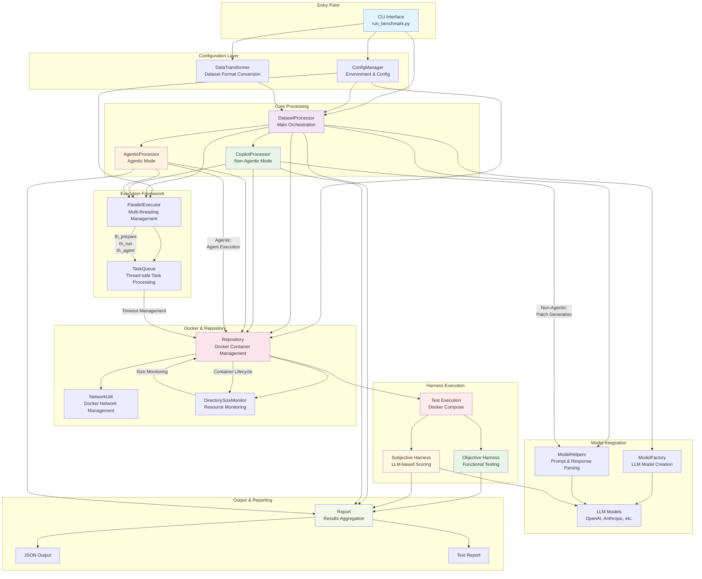

# CVDP Benchmark Developer Guide

Internal development documentation for the CVDP Benchmark framework.

## Overview

This guide covers internal development practices, implementation details, and advanced configuration for maintainers and contributors to the CVDP Benchmark project.

**For End Users:** See the main [README.md](README.md) for usage instructions, or workflow-specific guides:
- [Non-Agentic Workflow Guide](README_NON_AGENTIC.md) 
- [Agentic Workflow Guide](README_AGENTIC.md)
- [Extension Development Guide](examples/README.md)

## Project Architecture

### Core Components

The benchmark is structured around several key modules:

```
src/
├── dataset_processor.py     # Main orchestration and evaluation logic
├── repository.py           # Docker harness management and execution
├── model_helpers.py        # LLM model integration and API handling
├── parallel_executor.py    # Multi-threaded execution management
├── report.py              # Results aggregation and reporting
├── config_manager.py      # Configuration and environment management
├── dir_monitor.py         # Docker directory size monitoring
├── network_util.py        # Docker network management
├── commercial_eda.py      # Commercial EDA tool validation and infrastructure management
└── data_transformer.py    # Dataset format transformations
```

### Class Flow Diagram

The following diagram illustrates the flow of classes and their interactions within the benchmark framework:



**Key Flow Patterns:**

1. **Entry Point**: CLI interface (`run_benchmark.py`) initializes the benchmark workflow
2. **Configuration**: `ConfigManager` handles environment variables and settings across all components
3. **Dataset Processing**: `DatasetProcessor` serves as the main orchestrator, with specialized subclasses for different modes:
   - `CopilotProcessor`: Handles non-agentic workflows with LLM patch generation
   - `AgenticProcessor`: Manages agentic workflows with Docker-based agent execution
4. **Model Integration**: `ModelHelpers` and `ModelFactory` provide LLM interaction capabilities
5. **Parallel Execution**: `ParallelExecutor` and `TaskQueue` manage multi-threaded processing
6. **Docker Management**: `Repository` class handles container lifecycle, resource monitoring, and coordinates test harness execution
7. **Harness Execution**: Test validation occurs through two complementary approaches:
   - `Objective Harness`: Functional testing using Docker Compose with verification tools
   - `Subjective Harness`: LLM-based scoring for qualitative assessment
8. **Reporting**: `Report` class aggregates results from both objective and subjective evaluations, generating JSON and text outputs

### Docker Integration

The system uses two distinct Docker Compose workflows:

1. **Agent Execution**: `docker-compose-agent.yml` (auto-generated)
2. **Test Harness**: `docker-compose.yml` (from dataset or auto-generated)

Both workflows are managed through `repository.py` which handles:
- Container lifecycle management
- Volume mounting and isolation
- Resource monitoring and cleanup
- Network configuration

### Directory Structure Monitoring

The `dir_monitor.py` module provides automatic monitoring of Docker workspace directories to prevent runaway disk usage:

**Key Features:**
- Real-time directory size monitoring during Docker execution
- Configurable size thresholds (default: 50MB)
- Automatic container termination on threshold breach
- Optional file compression for space recovery
- Detailed logging and reporting

**Configuration Variables:**
- `DOCKER_QUOTA_THRESHOLD_MB` - Size limit before termination (default: 50)
- `DOCKER_QUOTA_CHECK_INTERVAL` - Check frequency in seconds (default: 1)
- `DOCKER_QUOTA_MIN_COMPRESS_SIZE_MB` - Minimum file size for compression (default: 10)

**Note:** File compression is currently disabled by default in the codebase but can be enabled via the `compress_on_threshold` parameter.

### Commercial EDA Tool Management

The `commercial_eda.py` module provides automatic validation and infrastructure management for commercial EDA tools:

**Key Features:**
- Automatic detection of datasets requiring commercial EDA tools (categories 12, 13, 14)
- Docker network existence validation and auto-creation for license connectivity
- Verification image validation and local availability checking
- Configuration validation with informative error messages
- Integration with entry point validation in `run_benchmark.py` and `run_samples.py`

**Validation Flow:**
1. **Dataset Analysis** - Scan dataset file for EDA tool categories
2. **Configuration Check** - Validate license network and image settings from `config_manager.py`
3. **Network Validation** - Check if Docker license network exists
4. **Image Validation** - Verify that verification images are available locally
5. **Auto-Creation** - Create network if missing and auto-creation enabled
6. **Error Reporting** - Provide actionable feedback for configuration issues

**Integration Points:**
- Entry point validation in main scripts prevents execution with invalid EDA tool setup
- Configuration management through `ConfigManager` for centralized settings
- Constants definition in `constants.py` for category-based EDA tool requirements
- Extensible framework for supporting multiple commercial EDA vendors

### Parallel Execution Framework

The `parallel_executor.py` module provides thread-safe execution management:

- **Queue-based processing** with configurable thread pools
- **Timeout management** for both individual tasks and entire queues
- **Exception handling** with detailed error reporting
- **Resource cleanup** ensuring Docker containers are properly terminated

## Test Suite Architecture

### Test Categories and Structure

The test suite (in `tests/`) provides comprehensive validation:

**Fast Suite (Development):**
- Core functionality validation in 2-3 minutes
- Optimized for development workflow
- Essential pass/fail verification

**Full Suite (CI/Production):**
- Comprehensive validation covering all scenarios
- 5+ minutes execution time
- Release validation and edge case coverage

### Expected Test Results

| Test Category | Expected Pass Rate | Purpose |
|---------------|-------------------|---------|
| **Golden Mode** | ~90-100% | Reference solution validation |
| **No-Patch Mode** | Exactly 0% | Negative control verification |
| **LLM Non-Agentic** | ~23% | LLM performance baseline |
| **Agent Mode** | ~0%* | Agent execution validation |
| **Force Modes** | ~90-100% | Dataset transformation testing |

*Agent mode tests completion, not necessarily correctness

### Test Data Requirements

Critical test IDs that must exist for compatibility:
- `cvdp_copilot_cellular_automata_0017` (non-agentic dataset)
- `cvdp_agentic_run_length_0001` (agentic dataset)

## Configuration Management

### Environment Variables

**Core Configuration:**
- `BENCHMARK_THREADS` - Default parallelization level
- `BENCHMARK_PREFIX` - Default output directory prefix
- `DEFAULT_MODEL` - Default LLM model when none specified (default: "gpt-4o-mini")
- `CUSTOM_MODEL_FACTORY` - Path to custom model factory

**Docker Configuration:**
- `DOCKER_TIMEOUT` - Test harness timeout (default: 600s)
- `DOCKER_TIMEOUT_AGENT` - Agent execution timeout (default: 600s)
- `VERIF_EDA_IMAGE` - Custom verification image for advanced DV (required for Xcelium-based datasets)

**Advanced Monitoring:**
- `DOCKER_QUOTA_THRESHOLD_MB` - Directory size limit (default: 50)
- `DOCKER_QUOTA_CHECK_INTERVAL` - Monitoring frequency (default: 1s)
- `DOCKER_QUOTA_MIN_COMPRESS_SIZE_MB` - Compression threshold (default: 10)

**License Network Configuration:**
- `LICENSE_NETWORK_NAME` - Docker network name for EDA license server connectivity (default: "licnetwork")
- `LICENSE_NETWORK_AUTO_CREATE` - Automatically create license network if missing (default: true)

**API Integration:**
- `OPENAI_USER_KEY` - OpenAI API key for LLM models
- `ENABLE_SUBJECTIVE_SCORING` - Enable LLM-based subjective scoring

### Configuration Precedence

1. Command-line arguments (highest priority)
2. Environment variables 
3. `.env` file values
4. Default values (lowest priority)

## Dataset Format Specifications

### Non-Agentic Dataset Structure

```json
{
  "id": "cvdp_copilot_[name]_[number]",
  "categories": ["category", "difficulty"],
  "input": {
    "prompt": "Task instruction",
    "context": {
      "file_path.v": "file content"
    }
  },
  "output": {
    "context": {
      "file_to_patch.v": "expected output"
    }
  },
  "harness": {
    "files": {
      "docker-compose.yml": "test configuration"
    }
  }
}
```

### Agentic Dataset Structure

```json
{
  "id": "cvdp_agentic_[name]_[number]",
  "categories": ["category", "difficulty"],
  "input": {
    "prompt": "Task instruction",
    "context": {
      "docs/file.md": "documentation",
      "rtl/module.v": "hardware description",
      "verif/testbench.sv": "verification code",
      "rundir/script.tcl": "execution script"
    }
  },
  "harness": {
    "files": {
      "docker-compose.yml": "test configuration"
    }
  }
}
```

### Dataset Transformation

The `data_transformer.py` module provides automatic conversion between formats:

**Force Modes:**
- `--force-copilot` - Convert agentic datasets to non-agentic format
- `--force-agentic` - Convert non-agentic datasets to agentic format
- `--force-agentic-include-golden` - Include reference solution in agent workspace
- `--force-agentic-include-harness` - Include harness files in agent workspace

## Development Workflows

### Adding New Features

1. **Design Phase**
   - Document the feature requirements
   - Consider impact on both non-agentic and agentic workflows
   - Design configuration options and defaults

2. **Implementation Phase**
   - Follow existing patterns in module structure
   - Add appropriate logging and error handling
   - Include configuration management

3. **Testing Phase**
   - Add tests to both fast and full regression suites
   - Test with both non-agentic and agentic datasets
   - Verify backward compatibility

4. **Documentation Phase**
   - Update appropriate README files
   - Add configuration documentation
   - Include usage examples

### Docker Image Management

**Base Images:**
- Verification harness images in `us-central1-docker.pkg.dev/turing-gpt/verilogeval/`
- Custom agent base images as needed

**Development Images:**
- `cvdp-example-agent` - Built via `examples/agent/build_agent.sh`
- Custom test images for specific validation scenarios

### Debugging and Troubleshooting

**Common Development Issues:**

**Docker Container Cleanup:**
```bash
# Force cleanup of all containers
docker compose down --remove-orphans
docker system prune -f

# Rebuild docker images as needed

# Check for hanging containers
docker ps -a | grep cvdp
```

## Code Quality and Standards

### Python Coding Standards
- Follow PEP 8 style guidelines
- Use type hints where appropriate
- Include comprehensive docstrings for public methods
- Handle exceptions explicitly with appropriate logging

### Docker Best Practices
- Use multi-stage builds where appropriate
- Minimize image size and layers
- Include health checks for long-running containers
- Use non-root users where possible

### Testing Standards
- All new features must include regression tests
- Test both positive and negative cases
- Include performance benchmarks for resource-intensive operations
- Maintain backward compatibility for dataset formats

## Performance Optimization

### Parallel Execution Tuning

**Thread Pool Configuration:**
- Default: 1 thread (conservative for Docker resource management)
- Recommended development: 2-4 threads based on system resources
- Production scaling: Consider Docker daemon limits and memory constraints

**Resource Monitoring:**
- Monitor Docker daemon resource usage during high-parallelization runs
- Track directory growth rates to tune quota thresholds
- Profile memory usage for large dataset processing

### Docker Performance

**Volume Mount Optimization:**
- Use bind mounts for read-heavy scenarios
- Consider tmpfs mounts for temporary file operations
- Monitor I/O patterns for optimization opportunities

**Network Configuration:**
- Use custom networks for isolation without performance overhead
- Leverage Docker's internal DNS for service discovery
- Minimize external network dependencies during testing

## Release Management

### Version Compatibility

**Dataset Format Versions:**
- Maintain backward compatibility for existing dataset files
- Version dataset schema changes appropriately
- Provide migration utilities for format updates

**API Compatibility:**
- Maintain stable interfaces for custom model factories
- Version agent API requirements clearly
- Deprecate features gradually with migration paths

### Release Checklist

1. **Testing:**
   - Run full regression suite successfully
   - Validate on representative datasets
   - Test custom model and agent integrations

2. **Documentation:**
   - Update version references in README files
   - Document any breaking changes
   - Update configuration option documentation

3. **Deployment:**
   - Tag releases appropriately
   - Update Docker base images if needed
   - Communicate changes to users

## Security Considerations

### Docker Security

**Container Isolation:**
- Run containers with minimal privileges
- Use read-only file systems where possible
- Implement resource limits to prevent DoS

**Network Security:**
- Use isolated Docker networks
- Minimize exposed ports
- Validate all external network access

### API Security

**Model API Keys:**
- Store API keys securely in environment variables
- Never log or expose API keys in output
- Implement rate limiting where appropriate

**Input Validation:**
- Sanitize all dataset inputs
- Validate file paths to prevent directory traversal
- Implement size limits for user inputs

---

## Contributing

This developer guide is intended for internal development and maintenance. For contribution guidelines and external development, see the main [README.md](README.md) and [examples/README.md](examples/README.md).

For questions about internal development practices, consult the existing codebase patterns and this documentation. 